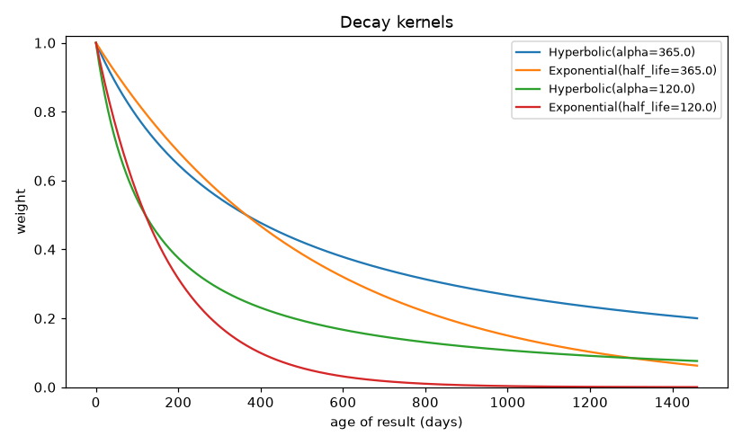
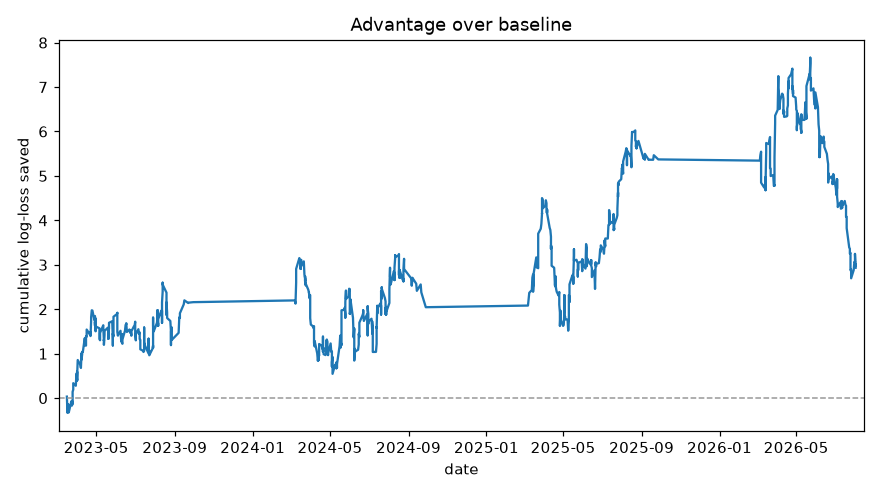
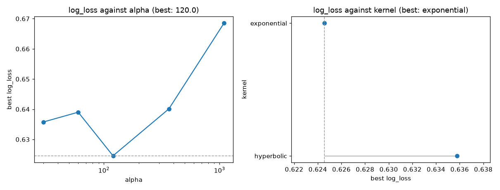
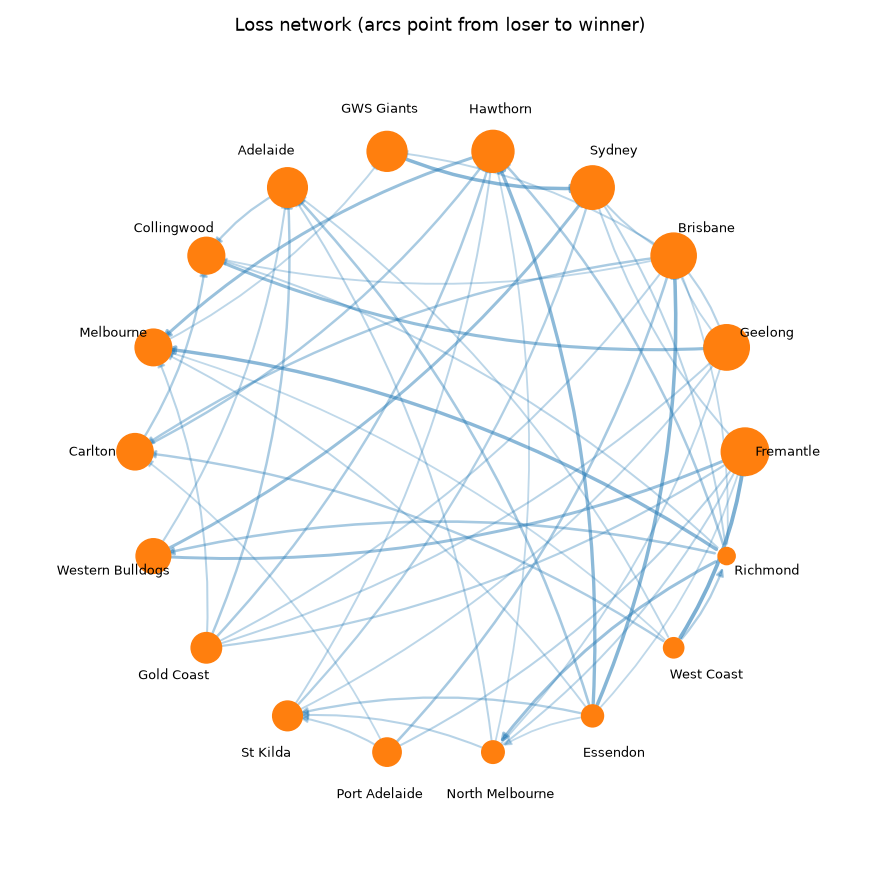
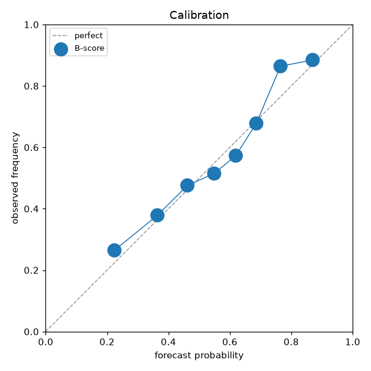
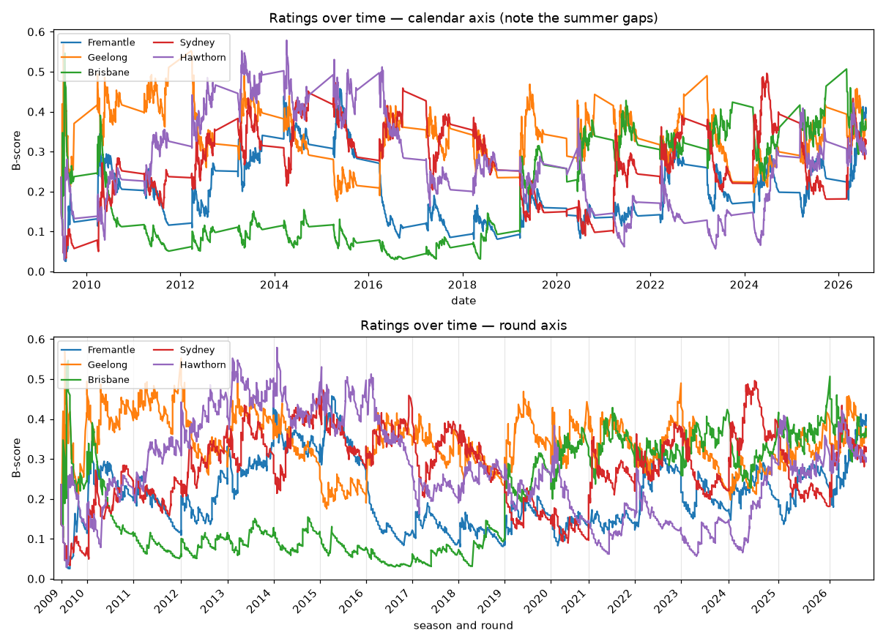

# bscores tutorial

A guided tour, from a five-line rating to a tuned, back-tested, diagnosed
forecasting model. Every code block here was run against the bundled AFL
archive, and every number printed alongside it is that run's actual output.

Work through it in order and you will have built a model that beats the paper's
own defaults by 0.05 of log-loss. Or jump to what you need:

| | |
| --- | --- |
| [1. Setup and data](#1-setup-and-data) | loading fixtures, bringing your own |
| [2. Your first ratings](#2-your-first-ratings) | `rate`, `leaderboard`, `Rating` |
| [3. The property that makes B-scores different](#3-the-property-that-makes-b-scores-different) | why everyone's rating moves |
| [4. Feeding the model](#4-feeding-the-model) | teams, draws, ranks, bulk loading |
| [5. Memory: decay kernels](#5-memory-decay-kernels) | `Hyperbolic`, `Exponential`, `Window` |
| [6. How much a result counts](#6-how-much-a-result-counts) | margin and importance weights |
| [7. Forecasting](#7-forecasting) | `fit`, `predict_win`, calibration |
| [8. Evaluating honestly](#8-evaluating-honestly) | `rolling_forecast`, baselines, significance |
| [9. Tuning](#9-tuning) | `grid_search`, sensitivity, held-out reporting |
| [10. Diagnostics](#10-diagnostics) | explaining, calibration, network health |
| [11. Rating histories and plots](#11-rating-histories-and-plots) | `score_history`, the round axis |
| [12. Seasons and rounds](#12-seasons-and-rounds) | recovering structure from fixtures |
| [13. Simulating a season](#13-simulating-a-season) | Monte Carlo standings |
| [14. The command line](#14-the-command-line) | no-Python workflows |
| [15. Recipes and gotchas](#15-recipes-and-gotchas) | things that will bite you |

---

## 1. Setup and data

```bash
REPO="git+https://github.com/dclaz/bscores@claude/bscores-python-impl-dsbd3i"
pip install "bscores[all] @ $REPO"
```

The `all` extra pulls pandas, scipy and matplotlib. The core needs only numpy;
everything optional is imported lazily, so a plain install still rates and
forecasts.

### The bundled archive

```python
from bscores.datasets import load_afl

afl = load_afl(as_frame=False)
print(afl)
```
```
MatchData(3533 matches, 18 teams, 2009-06-19 to 2026-08-02)
```

`MatchData` is a plain dataclass of numpy arrays:

```python
afl.date, afl.date_time, afl.season, afl.round, afl.home_team, afl.away_team,
afl.venue, afl.home_score, afl.away_score, afl.margin, afl.outcome, afl.final,
afl.home_odds, afl.away_odds
```

```python
print(afl.date[0], afl.home_team[0], "vs", afl.away_team[0],
      "| margin", afl.margin[0], "| outcome", afl.outcome[0],
      "|", afl.round_label[0])
```
```
2009-06-19 Essendon vs Melbourne | margin 48 | outcome 1.0 | 2009 R1
```

`load_afl()` with no argument returns a `pandas.DataFrame` instead — same 14
columns, 3533 rows.

### The only four things bscores needs

Everything in the package is built on four parallel sequences:

| | what it is |
| --- | --- |
| `home` | competitor names, one per match |
| `away` | their opponents |
| `outcome` | `1.0` home win, `0.0` away win, `0.5` draw |
| `times` | when each match happened |

`times` is flexible — ISO strings, `datetime`, `datetime.date`, `numpy.datetime64`,
`pandas.Timestamp`, or plain numbers if you want an abstract clock (round
numbers, match indices). Everything is normalised internally to days since the
epoch, which is why `alpha` is always expressed in days.

Nothing about this is sport-specific. Pairwise preference contests work exactly
the same way:

```python
from bscores import BScoreModel

model = BScoreModel(alpha=30.0)
model.add_matches(
    home    = ["model_a", "model_b", "model_c", "model_a", "model_b"],
    away    = ["model_b", "model_c", "model_a", "model_c", "model_a"],
    outcome = [1.0,       1.0,       1.0,       1.0,       0.5],
    times   = ["2025-01-06", "2025-01-06", "2025-01-13", "2025-01-20", "2025-01-20"],
)
model.leaderboard()
```
```
[Rating(name='model_a', score=0.748602, matches=4, rank=1),
 Rating(name='model_b', score=0.493419, matches=3, rank=2),
 Rating(name='model_c', score=0.442868, matches=3, rank=3)]
```

---

## 2. Your first ratings

```python
from bscores import BScoreModel

model = BScoreModel(alpha=365.0)          # a result halves in weight after a year

model.rate([["Geelong"], ["Carlton"]],  at="2021-03-18")   # teams, best first
model.rate([["Geelong"], ["Essendon"]], at="2021-03-25")
model.rate([["Carlton"], ["Essendon"]], at="2021-04-01")
model.rate([["Essendon"], ["Geelong"]], at="2021-04-08")
model.rate([["Carlton"], ["Geelong"]],  at="2021-04-15")

model.rating("Geelong")
```
```
Rating(name='Geelong', score=0.636926, matches=4)
```

```python
model.leaderboard()
```
```
[Rating(name='Carlton',  score=0.658014, matches=3, rank=1),
 Rating(name='Geelong',  score=0.636926, matches=4, rank=2),
 Rating(name='Essendon', score=0.401675, matches=3, rank=3)]
```

Carlton tops it on three matches while Geelong has four — the recursion at work.
Carlton beat Geelong, who beat plenty; wins over strong opponents count more.

A `Rating` carries `.name`, `.score`, `.matches`, `.wins`, `.losses` and `.rank`.
`.score` is an entry in a unit-norm eigenvector, so it always sits in `[0, 1]`
and the scale depends on how many competitors there are. For display:

```python
model.rating("Geelong").ordinal()          # 636.9  — score * 1000
model.rating("Geelong").ordinal(scale=400, target=1500)   # Elo-ish scale
```

Raw access when you want to skip the objects:

```python
model.players        # ['Geelong', 'Carlton', 'Essendon']  — id order
model.scores()       # array([0.6369, 0.658 , 0.4017])
```

---

## 3. The property that makes B-scores different

Elo, Glicko and Bradley-Terry all treat a match as a private transaction: two
ratings move, everyone else's stay put. B-scores do not, and this is the whole
point of the method.

Carrying on from the model above — Essendon is **not** in the next match:

```python
model.rating("Essendon").score            # 0.4017
model.rate([["Carlton"], ["Geelong"]], at="2021-04-22")
model.rating("Essendon").score            # 0.2999
```

Essendon's rating fell by a quarter without taking the field. Its one win was
over Geelong, and Geelong just lost again — so that win is worth less than it
was a minute ago.

This is why ratings are computed by *solving the network* rather than by
updating a pair of numbers, and why `rate()` returns the refreshed ratings and
mutates the model rather than being a pure function.

**Practical consequence:** there is no meaningful "rating update" to cache. If
you need ratings at many points in time, use `score_history` (§11), which
computes them all in one causal sweep, rather than calling `rating()` in a loop.

---

## 4. Feeding the model

Four ways in, all equivalent:

```python
model = BScoreModel(alpha=180.0)

# 1. teams, best first — mirrors openskill.py
model.rate([["Geelong"], ["Carlton"]], at="2024-03-01")

# 2. winner/loser, when that reads better
model.rate_result("Geelong", "Essendon", at="2024-03-08")
model.rate_result("Geelong", "Essendon", at="2024-03-08", draw=True)   # a draw

# 3. multi-member teams — every member gets the credit
model.rate([["Alice", "Bob"], ["Carol", "Dave"]], at="2024-03-15")

# 4. explicit ranks, for three-plus-way contests
model.rate([["P"], ["Q"], ["R"]], ranks=[1, 2, 3], at="2024-03-22")
```

And in bulk, which is what you want for a real fixture list:

```python
model.add_matches(afl.home_team, afl.away_team, afl.outcome, afl.date)
model.rate_many(winners, losers, times)        # if your data is winner/loser shaped
```

Draws count as half a win and half a loss:

```python
model.rating("Essendon").wins, model.rating("Essendon").losses    # (0.5, 1.5)
```

How much a draw moves the network is controlled by `draw_weight` (default
`0.5`, splitting one match's worth of credit both ways). Set `draw_weight=0`
for a sport with no draws.

### On real data

```python
model = BScoreModel(alpha=120.0, kernel="exponential")
model.add_matches(afl.home_team, afl.away_team, afl.outcome, afl.date)

for r in model.leaderboard(top=8):
    print(f"{r.rank:>2} {r.name:<18}{r.score:>8.4f}{r.matches:>6}{r.wins:>7.1f}")
```
```
 1 Fremantle           0.4059   395  212.5
 2 Geelong             0.3346   419  286.5
 3 Hawthorn            0.3126   406  242.5
 4 Sydney              0.3120   411  253.5
 5 Brisbane            0.3033   402  195.5
 6 Adelaide            0.2894   393  202.0
 7 GWS Giants          0.2584   345  165.0
 8 Western Bulldogs    0.2454   399  208.0
```

Note Fremantle first on 212 wins while Geelong has 286. B-scores rate *recent
wins over strong opponents*, not career totals — with `alpha=120` the 2010s
count for very little.

The model keeps the full dated history, so you can ask what the table looked
like at any past moment without rebuilding anything:

```python
for r in model.leaderboard(top=3, at="2015-06-01"):
    print(f"{r.rank:>2} {r.name:<18}{r.score:>8.4f}")
```
```
 1 Fremantle           0.4720
 2 Sydney              0.3803
 3 Hawthorn            0.3143
```

---

## 5. Memory: decay kernels

`alpha` is the single most important parameter in the package. It sets how fast
results are forgotten, and it moves accuracy further than the choice of rating
system does.

```python
from bscores.decay import Hyperbolic, Exponential, Uniform, Window

ages = [0, 90, 365, 1095, 3650]          # days

Hyperbolic(365.0).weight(ages)   # [1.  0.8022  0.5  0.25   0.0909]
Exponential(365.0).weight(ages)  # [1.  0.8429  0.5  0.125  0.001 ]
Uniform().weight(ages)           # [1.  1.      1.   1.     1.    ]
Window(730.0).weight(ages)       # [1.  1.      1.   0.     0.    ]
```



Both `Hyperbolic` and `Exponential` halve at `alpha` days by construction — they
differ entirely in the **tail**. At ten years the hyperbolic kernel still counts
a result at 9% weight; the exponential has it at 0.1%. On a long archive that is
thousands of stale results still voting:

```python
Hyperbolic(365.0).effective_age()     # 364_999_635 days — effectively never forgets
Exponential(365.0).effective_age()    # 7_275 days
```

That single fact explains most of the difference between the paper's defaults
and a tuned model on AFL (§9).

Kernels can be composed and abbreviated:

```python
Window(730.0, Exponential(180.0))     # exponential decay, hard cut-off at 2 years
BScoreModel(alpha=120.0)                          # -> Hyperbolic(120)
BScoreModel(alpha=120.0, kernel="exponential")    # -> Exponential(120)
BScoreModel(kernel=Window(365.0))                 # -> pass an instance
```

`max_age` does something related but different — it is an *optimisation*,
bounding the work per epoch by dropping old results entirely:

```python
BScoreModel(alpha=365.0, max_age=1095.0)   # ignore anything over 3 years old
```

Use the kernel to express what you believe about memory; use `max_age` to buy
speed when the tail is not worth paying for.

---

## 6. How much a result counts

Every arc in the network carries a weight. By default a win is a win, but a
28-point win probably says more than a 2-point one.

```python
from bscores.weights import margin_weight, importance_weight

margins = [1, 6, 24, 60, 120]
margin_weight(margins, scheme="linear", scale=24.0, cap=3.0)   # [1.042 1.25 2.  3.   3.   ]
margin_weight(margins, scheme="sqrt",   scale=24.0, cap=3.0)   # [1.021 1.118 1.414 1.871 2.449]
margin_weight(margins, scheme="log",    scale=24.0, cap=3.0)   # [1.041 1.223 1.693 2.253 2.792]

importance_weight([False, True, False], weight=2.0)            # [1. 2. 1.]  — finals count double
```

`scale` sets the margin worth one extra unit of weight; `cap` stops a
90-point thrashing from dominating the network. Feed them in at ingestion:

```python
mov = margin_weight(afl.margin, scheme="linear", scale=24.0, cap=3.0)
model.add_matches(afl.home_team, afl.away_team, afl.outcome, afl.date, weights=mov)
```

On the AFL archive that gives weights from 1.00 to 3.00, mean 2.16. It is the
second-biggest lever in the package after `alpha`.

---

## 7. Forecasting

Ratings are not probabilities. The paper fits a logistic regression on the two
ratings (Eq. 3) and `fit` does the whole thing in one pass — ingest, compute
causal features, calibrate:

```python
model = BScoreModel(alpha=120.0, kernel="exponential").fit(
    afl.home_team, afl.away_team, afl.outcome, afl.date,
    weights=mov, transform="sqrt", model_draws=True,
)

model.predict_win([["Geelong"], ["Carlton"]])       # [0.748, 0.252]
model.predict_draw([["Geelong"], ["Carlton"]])      # 0.0086
model.predict_rank([["Geelong"], ["Carlton"], ["Essendon"]])
# [(1, 0.567), (2, 0.342), (3, 0.09)]   -> (most likely rank, win probability)
```

The fitted coefficients are `[intercept, home, away]`:

```python
from bscores.calibration import sigmoid

model.calibrator.beta_                # [0.2511, 5.356, -5.1108]
sigmoid(model.calibrator.beta_[0])    # 0.5625 — against a 0.5718 home win rate
```

Leaving the home and away slopes free rather than forcing them symmetric is what
lets the intercept carry home advantage. `symmetric=True` ties them if your
competition has no home side.

`transform` reshapes the features before the logit — `"identity"`, `"sqrt"` or
`"log"`. Ratings are bounded in `[0, 1]` and bunched near zero, so `sqrt`
usually helps a little and costs nothing.

### Causality is enforced, not assumed

The features `fit` calibrates on are computed with `inclusive=False`: each match
sees only results that happened **strictly before** it. So ingesting the whole
fixture list first cannot leak the future backwards, and two fixtures in the
same round cannot see each other.

```python
home_s, away_s = model.match_scores(afl.home_team[-3:], afl.away_team[-3:], afl.date[-3:])
model.predict_proba(afl.home_team[-3:], afl.away_team[-3:], afl.date[-3:])
# [0.456  0.491  0.2613]
```

Use `predict_win` for a hypothetical fixture and `predict_proba` for a dated
one you want scored honestly.

---

## 8. Evaluating honestly

`rolling_forecast` runs the paper's protocol: fit on everything up to a cut-off,
forecast the next block, fold it in, refit, repeat.

```python
from bscores import rolling_forecast

result = rolling_forecast(
    afl.home_team, afl.away_team, afl.outcome, afl.date,
    model=BScoreModel(alpha=120.0, kernel="exponential", regularization=0.03),
    initial_train="2023-01-01", refit_every=300,
    weights=mov, transform="sqrt",
)
print(result)
```
```
BacktestResult(n=828, log_loss=0.5853, brier=0.1993, accuracy=0.6703)
```

```python
result.metrics()
# {'n': 828.0, 'log_loss': 0.5853, 'brier_score': 0.1993,
#  'accuracy': 0.6703, 'classification_error': 0.3297}

result.to_frame()          # date, teams, outcome, probability, both ratings, train_size
result.between("2025-01-01")
# BacktestResult(n=396, log_loss=0.5612, brier=0.1899, accuracy=0.6919)
```

`initial_train` takes an `int` count of matches, a `float` **strictly** between
0 and 1 as a fraction, or any date form. (A float ≥ 1 is read as a timestamp,
not a fraction — see §15.) `refit_every` controls how often the three logit
coefficients are re-estimated; it does not affect the ratings, which are always
fully causal, so it barely matters — 300 is the paper's value and fine.

### Compare against something

A number with no baseline means nothing.

```python
import numpy as np
from bscores import Elo
from bscores.metrics import evaluate, diebold_mariano

test = afl.date >= np.datetime64("2023-01-01")        # the same 828 matches
elo_p = Elo().run(afl.home_team, afl.away_team, afl.outcome)[test]

evaluate(afl.outcome[test], elo_p)
# {'log_loss': 0.6012, 'brier_score': 0.2062, 'accuracy': 0.657, ...}
```

| model | log-loss | Brier | accuracy |
| --- | ---: | ---: | ---: |
| B-score, tuned | **0.5853** | **0.1993** | 0.6703 |
| `Elo()` — paper defaults | 0.6012 | 0.2062 | 0.6570 |
| `Elo(home_advantage=35)` | 0.5888 | 0.2013 | **0.6800** |
| home-ground base rate | 0.6808 | 0.2417 | 0.5749 |

**Read that third row carefully.** The paper's Elo (Eqs. 4–5) has no home-advantage
term, which is a real handicap in a home/away sport. Giving Elo 35 rating points
at home closes most of the gap — and on accuracy it overtakes. Choose your
baseline before you look at the result, and prefer a strong one.

### Is the gap real?

```python
def log_losses(p, y):
    p = np.clip(p, 1e-15, 1 - 1e-15)
    return -(y * np.log(p) + (1 - y) * np.log(1 - p))

dm, pvalue = diebold_mariano(
    result.losses("log_loss"),                     # model A
    log_losses(elo_p, afl.outcome[test]),          # model B
)
```

| against | DM | p |
| --- | ---: | ---: |
| `Elo()` — paper defaults | −1.978 | 0.048 |
| `Elo(home_advantage=35)` | −0.560 | 0.576 |
| home base rate | −7.426 | <0.0001 |

The test compares *per-match* loss differences rather than two summary numbers,
which matters because both models face identical fixtures — the common
difficulty of any given match cancels. Negative favours the B-score model.

So: comfortably better than a base rate, and better than the paper's Elo by a
whisker at p = 0.048. Against a *properly specified* Elo, 828 matches cannot
tell them apart. That is the honest reading.



```python
from bscores.plotting import plot_backtest
plot_backtest(result, baseline=elo_p)
```

Rising means the model is beating the baseline; the slope is where the advantage
was actually earned.

---

## 9. Tuning

Tuning and reporting on the same matches inflates your result by however hard
you searched. `grid_search` scores on a **validation** window; `refit_best`
reports on a **test** window the search never saw.

```
|------- warm-up -------|--- validation ---|------ test ------|
 model builds a history   grid_search here   report this only
 2009-06 .. 2018-09       2019-03 .. 2022-09  2023-03 .. 2026-08
 1922 matches             783 matches         828 matches
```

```python
from bscores.tuning import grid_search, refit_best

search = grid_search(
    afl.home_team, afl.away_team, afl.outcome, afl.date,
    grid={
        "alpha":     [30.0, 60.0, 120.0, 365.0, 1095.0],
        "kernel":    ["hyperbolic", "exponential"],
        "transform": ["identity", "sqrt"],
    },
    validation_start="2019-01-01", validation_end="2023-01-01",
)
print(search)
```
```
TuningResult(20 configs, 10 rating passes, best log_loss=0.6246 at
             alpha=120.0, kernel='exponential', transform='sqrt')
```

**20 configurations, 10 rating passes.** `transform` only affects how ratings
become probabilities, so every configuration sharing network settings reuses one
causal rating sweep. That is why a 480-point grid costs 120 sweeps, not 480.
The split is in `NETWORK_KEYS` and `CALIBRATION_KEYS`:

```python
NETWORK_KEYS      # ('alpha', 'kernel', 'draw_weight', 'regularization', 'max_age', 'weights')
CALIBRATION_KEYS  # ('transform', 'symmetric', 'ridge', 'fit_intercept')
```

### Which knobs actually matter

```python
search.sensitivity("alpha")
# [(120.0, 0.6246), (30.0, 0.6358), (60.0, 0.639), (365.0, 0.6401), (1095.0, 0.6686)]
search.sensitivity("kernel")
# [('exponential', 0.6246), ('hyperbolic', 0.6358)]
```

`sensitivity` reports the *best achievable* score for each value, so a flat
profile genuinely means the knob does not matter.



```python
from bscores.plotting import plot_tuning
plot_tuning(search, "alpha")      # numeric -> line, log x by default
plot_tuning(search, "kernel")     # categorical -> dots on a zoomed axis
```

A sharp minimum means tune it. `alpha` spans 0.044 of log-loss across the grid;
`transform` spans 0.001.

The categorical panel is dots rather than bars on purpose: the differences that
decide these comparisons are a fraction of a percent, so bars drawn from zero
hide the result completely, and bars drawn from a truncated axis misrepresent
the ratio between them.

### Searching over weights

Weight vectors go in by name, since they are arrays rather than scalars:

```python
search = grid_search(
    ..., grid={"alpha": [60.0, 120.0], "weights": ["flat", "mov"]},
    weight_options={"flat": None, "mov": mov},
    validation_start="2019-01-01", validation_end="2023-01-01",
)
```

`weight_options` alone does nothing — `"weights"` must also appear in the grid.

### Report once, on data the search never saw

```python
held = refit_best(
    afl.home_team, afl.away_team, afl.outcome, afl.date,
    search.best_params, test_start="2023-01-01",
)
print(held)
```
```
BacktestResult(n=828, log_loss=0.5822, brier=0.1979, accuracy=0.6643)
```

The test log-loss (0.582) is *better* than the validation log-loss (0.625).
That is not overfitting in reverse — the two windows simply differ in how
predictable they happened to be. **Only gaps between models within one window
mean anything.** Never compare a validation number to a test number.

The settings this search converges on are stored for reuse:

```python
from bscores.tuning import AFL_TUNED
# {'alpha': 120.0, 'kernel': 'exponential', 'transform': 'sqrt',
#  'regularization': 0.03, 'weights': 'mov'}
```

Treat it as a worked example, not a default for your competition.

---

## 10. Diagnostics

### Why is this competitor rated here?

A B-score *is* the weighted sum of the ratings pointing at it, so it decomposes
exactly — this is arithmetic, not an attribution heuristic:

```python
from bscores.diagnostics import explain_rating

for c in explain_rating(model, "Fremantle", top=6):
    print(f"{c.opponent:<18} {c.share:>6.1%}  their score {c.opponent_score:>7.4f}"
          f"  arc weight {c.weight:>5.2f}")
```
```
Sydney              14.2%  their score  0.3249  arc weight  2.26
Western Bulldogs    14.2%  their score  0.1967  arc weight  3.73
Brisbane             9.8%  their score  0.3538  arc weight  1.42
Geelong              7.4%  their score  0.3572  arc weight  1.07
Gold Coast           7.3%  their score  0.1458  arc weight  2.60
Hawthorn             6.8%  their score  0.3012  arc weight  1.16
```

Sydney and the Bulldogs contribute equally by very different routes: Sydney rate
0.32 with 2.26 of accumulated arc weight, the Bulldogs 0.20 with 3.73. Beating a
good side once ≈ beating a middling side twice. Shares sum to exactly 1.0 over
all opponents.

### Is the network healthy enough to rate on?

```python
from bscores.diagnostics import network_summary
network_summary(model)
```
```
competitors          18
results              3563
arcs                 306
density              1.0
has_cycle            True
spectral_radius      12.696
unrated              0
solver               power
total_weight         304.9313
```

What to look for: `has_cycle` must be `True` for the eigenvector to exist at all
(see §15); `unrated` counts competitors with a zero score; `density` near 1 means
everyone has played everyone; `solver` says which route produced the answer.



```python
from bscores.plotting import plot_network
plot_network(model, min_weight=2.0)     # node size = rating, arcs = strongest results
```

`min_weight` is in the same units as the arc weights, which are decayed sums —
on this model they run from 0 to 5.0 with a median of 0.73, so `2.0` keeps the
54 strongest of 306 arcs. Set it too high and you get a legible but empty
circle; check the scale with `network_summary(model)["total_weight"]` divided by
`["arcs"]` if you are unsure.

### Can I trust the probabilities?

```python
from bscores.diagnostics import reliability_table, sharpness, upset_rate

print(reliability_table(result.outcome, result.probability, bins=6, strategy="quantile"))
```
```
predicted  observed  count     gap
    0.249     0.272    138  +0.023
    0.415     0.424    138  +0.009
    0.534     0.529    138  -0.005
    0.630     0.623    138  -0.007
    0.723     0.736    138  +0.012
    0.851     0.891    138  +0.040
```

Every bin within 0.04 of its forecast — these can be read at face value. The
model is if anything slightly *under*-confident at the top end: it says 85% and
gets 89%.

```python
sharpness(result.probability)     # 0.36 — 0 = never commits, 1 = always certain
upset_rate(result.outcome, result.probability, threshold=0.6)
# {'n_favoured': 393.0, 'upset_rate': 0.2366, 'expected': 0.2575}
```

Sharpness guards against the degenerate "always predict the base rate" model,
which is perfectly calibrated and useless. Of 393 matches called at better than
60%, 23.7% were upsets against 25.8% expected — slightly better than advertised.



```python
from bscores.plotting import plot_calibration
plot_calibration(result.outcome, result.probability, bins=8, label="B-score")
```

Marker area is proportional to bin count, so a wayward point built on ten
matches is visibly less damning than one built on two hundred.

### How much does the order move?

```python
import numpy as np
from bscores.diagnostics import rating_churn, head_to_head

history = model.score_history(np.unique(afl.date))     # see §11
churn = rating_churn(history, top=8)
churn["rank_change"].mean()      # 0.372 mean places moved per epoch
churn["entered_top"].sum()       # 422 entries into the top 8

head_to_head(afl.home_team, afl.away_team, afl.outcome,
             competitors=["Geelong", "Hawthorn", "Sydney"])
# {'names': [...], 'wins': array([[ 0. , 23. , 17.5], ...]),
#                  'played': array([[ 0, 33, 29], ...])}
```

Churn is how you feel out `alpha` before committing to a search: a short memory
tracks form and churns, a long one is steadier.

---

## 11. Rating histories and plots

`score_history` evaluates the whole network at each of a series of times, in one
causal sweep:

```python
import numpy as np
dates = np.unique(afl.date)
history = model.score_history(dates)
print(history)
```
```
RatingHistory(1567 epochs x 18 competitors)
```

```python
history.of("Geelong")          # that competitor's series
history.at("2020-07-01")       # everyone's scores at a moment
history.to_frame()             # pandas, indexed by date
history.times, history.scores  # (1567,) and (1567, 18)
```

This is the right way to get many-point ratings — one sweep with warm starts,
rather than a loop of independent solves.



```python
from bscores.plotting import plot_ratings

plot_ratings(history, top=5)                              # calendar axis
plot_ratings(history, top=5, x="round", schedule=afl)     # round axis
```

The two panels are the same data. On the calendar axis every summer is a flat
line through an off-season in which nothing happened, and across seventeen
seasons those gaps take up more width than the matches do. `x="round"` puts the
playing periods side by side and ticks at each season start.

`schedule` is anything carrying `date`, `season` and `round` arrays — a
`MatchData` will do. Without it, `x="round"` still collapses the gaps by spacing
epochs evenly, it just cannot label the seasons. You can also pass an explicit
array of x positions.

Every plotting function takes an optional `ax` and returns it, so they compose:

```python
fig, (left, right) = plt.subplots(1, 2)
plot_ratings(history, ax=left)
plot_calibration(result.outcome, result.probability, ax=right)
```

---

## 12. Seasons and rounds

Match archives usually carry dates but no round number. `bscores.schedule`
recovers both from the fixture list itself.

```python
from bscores.schedule import infer_seasons, infer_rounds, round_positions, round_labels

infer_seasons(afl.date)                                     # 1 .. 19
infer_rounds(afl.home_team, afl.away_team, afl.date, season=afl.season)
round_positions(afl.season, afl.round)                      # 0 .. 470, gapless
round_labels(afl.season, afl.round, final=afl.final)
# ['2009 R1', ..., '2014 R14', ..., '2026 R22']
```

The definitions are the natural ones:

* a **season** is a run of matches separated from the next by the off-season
  (any gap over `gap=60` days);
* a **round** is a maximal run in which no competitor plays twice — which is
  what a round *is*, so byes, split rounds and finals weeks fall out without
  needing a fixture template.

On AFL that produces 23 home-and-away rounds plus four finals weeks in a normal
season, and correctly fewer in 2020 (COVID-shortened) and 2026 (in progress).

The result is a function of the *set* of matches, not the order you pass them
in — same-timestamp matches are tie-broken on competitor name. So the bundled
`round` column is exactly reproducible:

```python
np.array_equal(
    infer_rounds(afl.home_team, afl.away_team, afl.date, season=afl.season),
    afl.round,
)   # True
```

If you have kick-off times rather than dates, pass those — a finer clock means
fewer ties and a more faithful reconstruction.

---

## 13. Simulating a season

```python
from bscores.simulation import simulate_season

teams = model.players
home, away = [], []
for i in range(len(teams)):
    for j in range(i + 1, len(teams)):
        home.append(teams[i])
        away.append(teams[j])

season = simulate_season(model, home, away, n_simulations=20_000, seed=0)
```
```
team                exp pts   P(1st)  P(top4)
Fremantle              53.4    38.9%    86.7%
Sydney                 50.2    21.4%    72.8%
Brisbane               48.7    15.4%    65.4%
Geelong                48.2    13.7%    63.0%
Adelaide               43.5     4.6%    37.1%
Collingwood            40.7     2.5%    24.0%
```

```python
season.expected_points()
season.finish_probability(1)
season.top_n_probability(4)
season.position_distribution("Fremantle")   # [0.3894 0.2307 0.1514 0.0952 0.0577 ...]
season.to_frame()
```

Mid-season, start from the actual ladder:

```python
season = simulate_season(model, remaining_home, remaining_away,
                         standings={"Richmond": 40.0, "Carlton": 36.0},
                         win_points=4.0, draw_points=2.0, n_simulations=20_000)
```

Forty points of head start takes Richmond from 0.0% to 72.3% for a top-four
finish.

**Caveat worth stating:** ratings are held fixed across each simulated season,
so the spread is a little narrower than reality — nobody improves or collapses
mid-run.

---

## 14. The command line

Installed as a console script, and runnable as `python -m bscores`:

```bash
bscores info
bscores rate     --data afl --alpha 120 --kernel exponential --top 5
bscores forecast --data afl --initial-train 2023-01-01
bscores tune     --data afl --alpha-grid 60 120 365 \
                 --validation-start 2019-01-01 --validation-end 2023-01-01
bscores simulate --data afl --simulations 20000 --seed 0
```

```
  #  competitor                 B-score  played     won
  1  Fremantle                   0.4059     395   212.5
  2  Geelong                     0.3346     419   286.5
  3  Hawthorn                    0.3126     406   242.5
```

`--data afl` uses the bundled archive; anything else is read as a CSV, with
`--home-col`, `--away-col`, `--outcome-col` and `--date-col` if your headers
differ. Add `--format json` to any subcommand to pipe it somewhere:

```bash
bscores rate --data results.csv --format json | jq '.ratings[0]'
bscores tune --data afl --format json | jq '.best'
```

---

## 15. Recipes and gotchas

**A float ≥ 1 in `initial_train` is a date, not a fraction.** `0.5` means half
the fixture list; `1.0`, `2.0` and `2000.0` are timestamps on whatever clock
`times` uses. This is deliberate — numeric clocks are supported — but it
surprises people. With calendar dates a stray float resolves to 1970 and you get
a clear error rather than a wrong answer.

**Acyclic networks have no eigenvector.** Before anyone has beaten someone who
beat someone else in a loop, the loss matrix is nilpotent and the equation has
no solution. `bonacich_centrality` detects this and falls back to a finite
Neumann series that grades the same idea; `EigenResult.method` reports
`"acyclic"` when it happens. In an opening round you will see very small scores
like `1.2e-82` — that is the fallback, working as designed, not a bug. Pass
`regularization=0.03` to keep the solve on the eigenvector path throughout.

**Disconnected competitors rate near zero.** A club that has only ever lost, or
a group that has never played the rest of the field, has nothing pointing at it.
Check `network_summary(model)["unrated"]`.

**Do not compare log-loss across windows.** A 0.58 on 2023–2026 and a 0.62 on
2019–2022 says those seasons differed in predictability, not that your model
improved. Only gaps *within* one window are meaningful.

**Tune `alpha` first, then weights, then the kernel.** In that order — they were
worth 0.044, 0.009 and 0.011 of validation log-loss respectively on AFL, and
everything else was noise.

**Warm starts are on by default.** Successive epochs barely move the
eigenvector, so `score_history` over 1567 epochs is fast. Turn `warm_start=False`
off only if you want every solve independent for testing.

**Scaling.** Networks over `dense_max_nodes=512` competitors switch to SciPy
CSR automatically. A 256-competitor, 50 000-match archive back-tests in about
6 seconds; the full AFL run is under a second.

---

## Where next

* [`README.md`](README.md) — the method, and what a tuned model achieves
* `python examples/afl_explore.py --plot out/` — diagnostics end to end
* `python examples/afl_tuning.py` — the full search, staged
* `python examples/benchmark.py` — throughput
* Every module's docstring documents its own equations and edge cases.

The paper this implements:

> Arcagni, A., Candila, V. & Grassi, R. (2023). *A new model for predicting the
> winner in tennis based on the eigenvector centrality.* Annals of Operations
> Research 325, 615–632. <https://doi.org/10.1007/s10479-022-04594-7>
